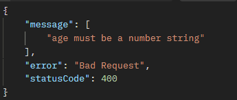

# Pipes

## What is pipe?

A pipe is a class annotated with `@Injectable` and implements a `PipeTransform` interface

## way to use pipe

- transformation: transform input data (string to integer, string to date, string to uuid)
- validation: check if data is valid if not throw an exception (a 2^31 Integer is passed though Pipe will throw an Exception)

### Build-in pipe

- ValidationPipe (make use of `class-validator` type to validate many type of data read-more:https://github.com/typestack/class-validator)
- ParseIntPipe (simple)
- ParseFloatPipe (simple)
- ParseBoolPipe (simple)
- ParseArrayPipe (look into it later)
- ParseUUIDPipe (simple)
- ParseEnumPipe (simple)
- DefaultValuePipe (simple, wide usage)
- ParseFilePipe (look into it later)

## Global pipe

By using global pipe every data is passed though pipe before enter the main Route handler
Best practices: use ValidatorPipe and passing annotation before request

## Examples

``` ts
 @Get(':id')
  async findOne(
    @Param('id', new ParseIntPipe({ errorHttpStatusCode: HttpStatus.NOT_ACCEPTABLE }))
    id: number,
  ) {
    return { id, ...cat };
  }
```

> This method will accept valid integer and throw when it's a different type (ex: 1.0,'string', .etc)

``` ts
class CreateCatDto {

  name: string;
  @IsNumberString() 
  age: number;
  breed: string;
}
```
> this will throw an image below if int is `333d`
>
> 